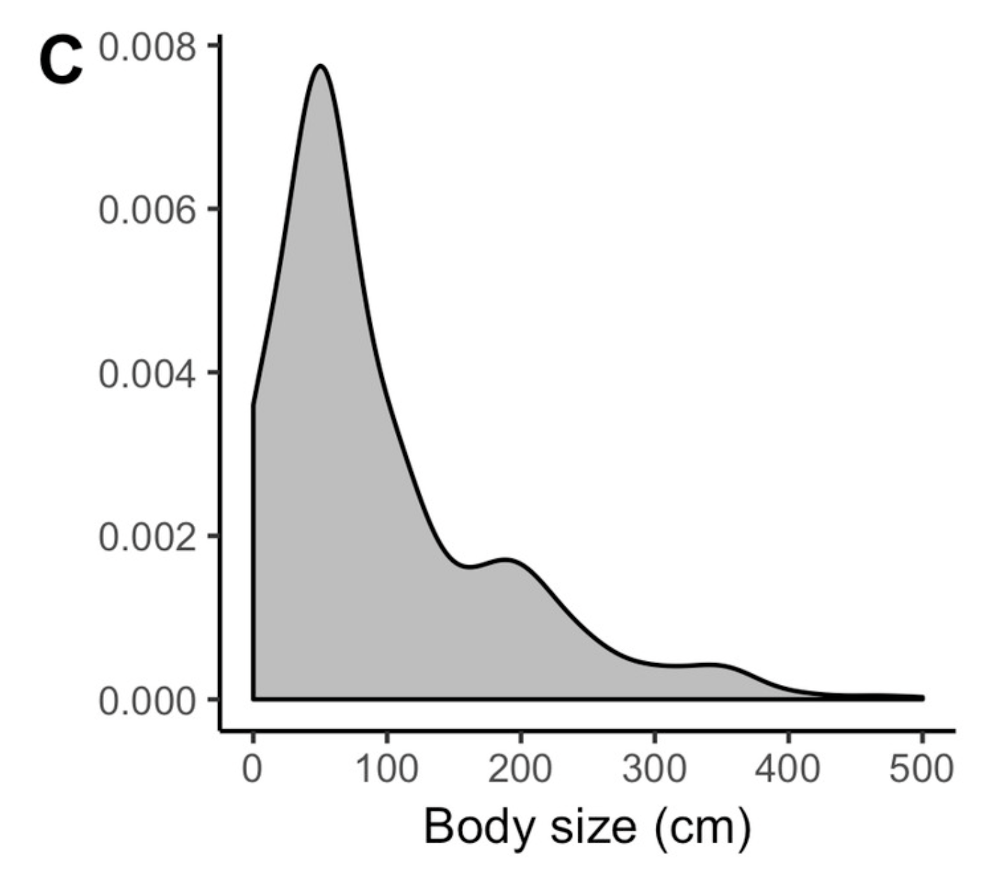
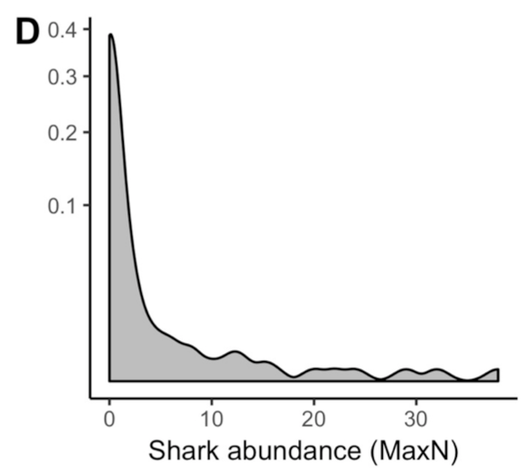
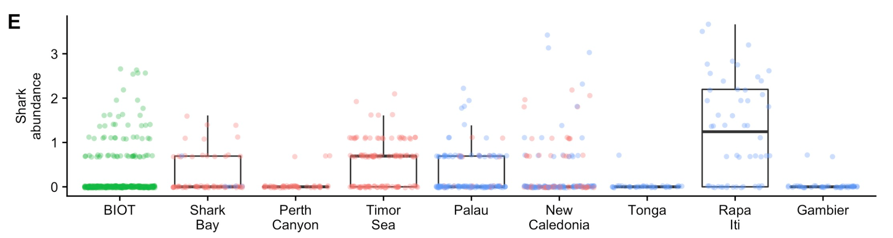
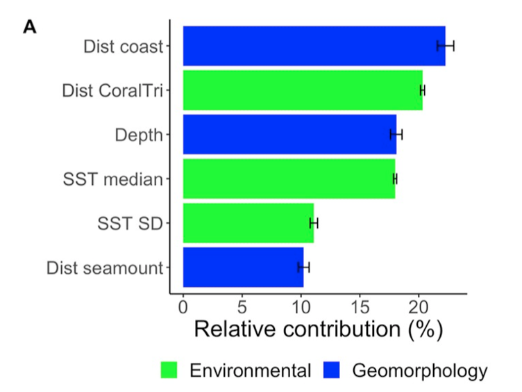
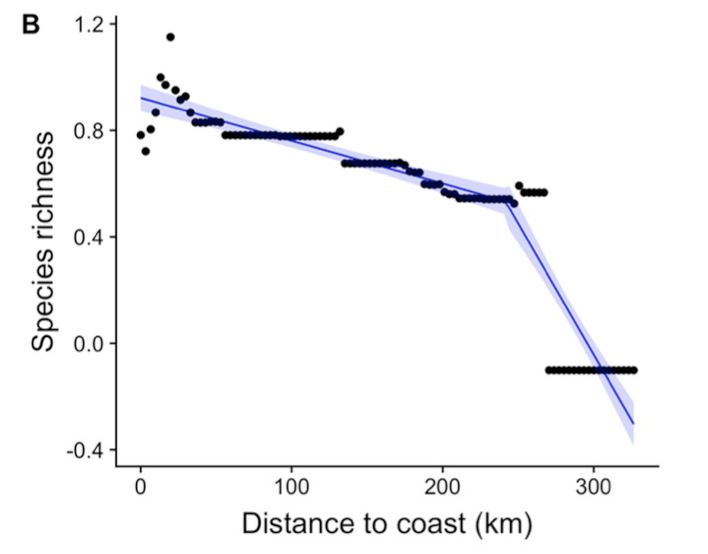
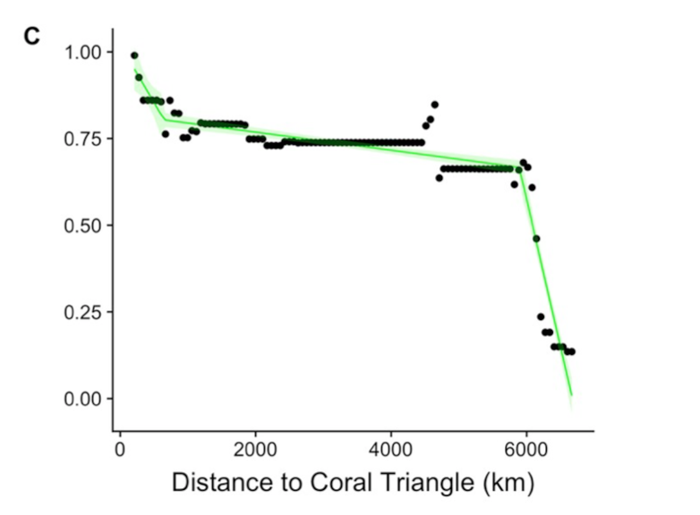
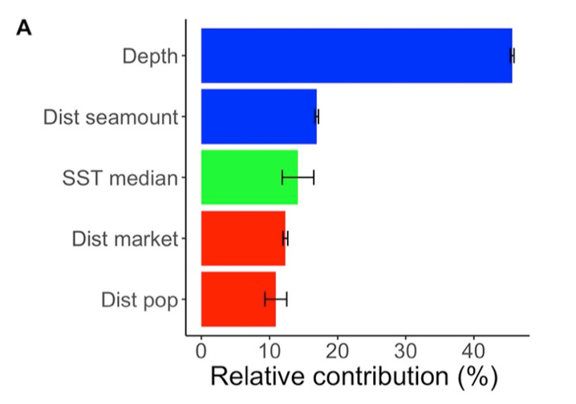
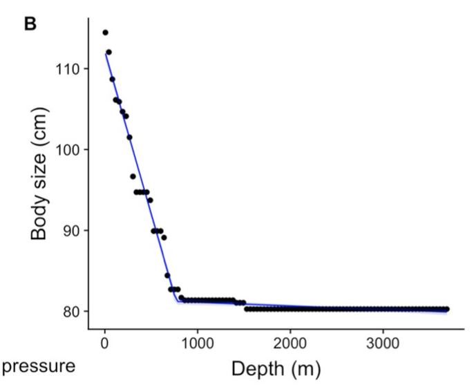
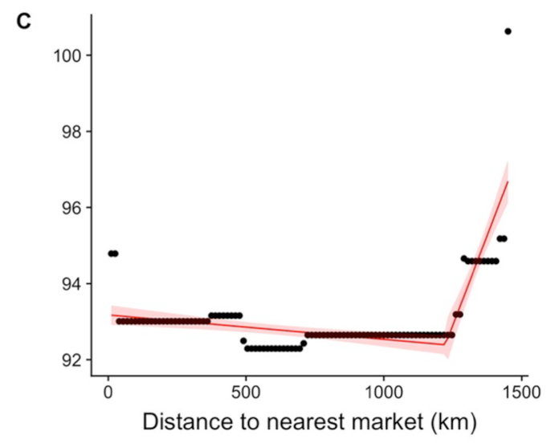
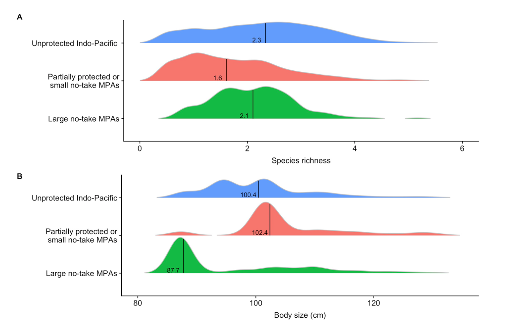

Title: Remote reefs and seamounts are the last refuges for marine predators across the Indo-Pacific

Link to the paper:
https://journals.plos.org/plosbiology/article?id=10.1371/journal.pbio.3000366#pbio.3000366.s007


Introduction: 
With technological advancements taking place in the fisheries industry, there has been unprecedented access to populations of marine predators including sharks, tuna, and billfishes, among others. In order to protect and preserve populations of marine predators, it is necessary to identify critical habitats of these marine predators across shallow coral reefs and in the deep ocean. 1041 mid-water baited videos were used to survey sharks and other pelagic predators across the Indo-Pacific. Three predator community attributes were modeled as a function of either geomorphology, environmental conditions, and human pressures: species richness, mean maximum body size, and shark abundance. 

Data Used: 
The primary data used for statistical and visual analyses in this study was raw vertebrate species richness, body size, shark abundance, and a wide variety of environmental, geomorphological, and human pressure predator community attributes at 1041 individual baited video deployments spread between the Eastern Indian and Western Pacific Oceans. 

Analyses Conducted in paper:
In this study, frequency distributions of species richness, body size, and shark abundance are plotted across all deployments, and shark abundances are plotted for each region in which baited remote underwater video systems were deployed. In addition, boosted regression trees are plotted to identify the relative contribution of variables contained within the three classes of predator community attributes to species richness, body size, and shark abundance across all 1041 deployments. In addition, species richness was assessed based on both distance to coast and distance to the Coral Triangle, body size was assessed based on both depth as well as distance to the nearest market, and shark abundance was assessed based on both distance to the nearest market and depth. Finally, the frequency distributions of predator attributes, specifically species richness, body size, and shark abundance, were plotted with respect to three different spatial management regimes: unprotected, partially protected, and large, no-take marine protected areas. 

Conclusions: 
All three attributes (species richness, mean maximum body size, and shark abundance) were primarily driven by geomorphology and environmental conditions, while human pressures, specifically distance to human markets, influenced body size and shark abundance, but not species richness. Refuges were identified > 1250 km from human markets and were identified as remote and shallow seabeds (e.g. seamounts, submerged banks, and reefs). Many of the refuges for both large-bodied predators and hotspots of shark abundance are currently under-represented within no-take marine protected areas (MPAs), and population recovery is unlikely to occur without strategic implementation of large, no-take MPAs that include these remote refuges as well as coastal areas. 

Loading libraries
```{r}
library(readr)
library(gbm)
library(tidyverse)
library(ggplot2)
library(tm)
library(expm)
library(e1071)
library(pdp)
library(knitr)
library(dplyr)
library(janitor)
```


Importing data 
```{r}
library(readxl)
f <- read_excel("data/raw.sr.bodysize.sharkabundance.xlsx")
colnames(f)[1] <- "location"
```


Line of code telling {knitr} where to find any images to include in ".html" output 
```{r}
knitr::opts_chunk$set(fig.path = "images/")
```


First would like to plot species richness, mean maximum body size, and shark abundance across all locations:

Plotting frequency distributions of species richness, body size, and shark abundance:


Species Richness (Figure 1B)
```{r}
#Species Richness
sr.density <- density(f$SR, from = 0) #obtaining frequency distribution of species richness using the density function
sr.density.plot <- plot(sr.density)   #plotting the frequency distribution of species richness 
```

```{r echo=FALSE, width="200px"}
knitr::include_graphics("images/Figure1B.png") #Embedding Figure 1B from paper to show side-by-side comparison between the paper's results and my re-analysis of the data
```

Overall, the species richness graph in the paper and the one generated in re-analysis were fairly similar to one another. 


Body Size
```{r}
#Body Size
body.size.density <- density(f$MaxL, from = 0)     #obtaining frequency distribution of body size using the density function
body.size.density.plot <- plot(body.size.density)  #plotting the frequency distribution of body size 
```

```{r echo=FALSE, width="200px"}
   #Embedding Figure 1C from paper to show side-by-side comparison between the paper's results and my re-analysis of the data
```

Overall, the body size graph in the paper and the one generated in re-analysis were fairly similar to one another. 


Shark Abundance
```{r}
#Shark Abundance
fb <- f %>% mutate(Shark.Abundance = exp(TaSharks)-1)  #shark abundance was recorded in raw data as TaSharks (log[SumMaxN +1]), so I took the exponent of TaSharks and subtracted 1 for each of the 1041 deployments (upon recommendation from the author after correspondence)
a <- ggplot(fb, aes(x = Shark.Abundance))              #plotting transformed shark abundance data using ggplot and taking frequency distribution using geom_density() function in ggplot2
a + geom_density() 

summary(fb$Shark.Abundance)                            #taking summary statistics of transformed shark abundance data 
summary(fb)
```
 
```{r echo=FALSE, width="200px"}
    #Embedding Figure 1D from paper to show side-by-side comparison between the paper's results and my re-analysis of the data
``` 

Interestingly, the shark abundance plot generated in re-analysis of the transformed TaShark data is starkly different from the same shark abundance frequency distribution plot in the publication, both with respect to the shape of the plot as well as the scale of the plot. This may be either due to a faulty data transformation error in data re-analysis, or that TaSharks may be the wrong variable used to plot shark abundance. 


Then, shark abundance was plotted for each region in which baited remote underwater video systems were deployed.

Shark Abundance Box plots (Figure 1E)
```{r}
fb$location <- gsub("[0-9]", "", as.character(f$location)) #removing numbers from location column in dataframe "f" using function gsub
shark.abund.boxplot <- boxplot(fb$Shark.Abundance~fb$location) #plotting shark abundance with respect to location (each region in which baited remote underwater video systems were deployed)
shark.abund.boxplot
```


```{r echo=FALSE, width="200px"}
      #Embedding Figure 1E from paper to show side-by-side comparison between the paper's results and my re-analysis of the data
```

Similar to Figure 1D, Figure 1E in the re-analysis is starkly different than the Figure 1E plot in the publication. In the raw dataset (/data/raw.sr.bodysize.sharkabundance.xlsx), there are 1041 datapoints (individual deployments), the exact same number  to that reported in the publication, however, there are 11 different locations listed in the raw data Excel sheet yet only 9 locations in the publication. Upon correspondence with the lead author, there were likely typos for the location name of some deployments, however, it was still difficult to assign mismatches to their proper locations since most locations had roughly, yet not the exact same number of deployments reported for both the publication and raw Excel sheet. Therefore, mismatches were left as such. Interestingly, despite the mismatches in number of deployments across sites, the scale of the plots (on the y-axis) are massively different and are much higher for the re-analyzed data, which are likely due to errors in data transformation or usage of the wrong variable (TaSharks) for plotting. 
Note:
Due to the difficulty of both data transformation and plotting of shark abundance, there were no further shark abundance analyses in re-analysis.  


Then, boosted regression trees (BRTs) are used to identify the relative contribution of multiple geomorphological, environmental, and human pressure variables to species richness and body size. Shark abundances 

Note: very odd how they give you the results in both figure and chart format but don't give background on how they went about narrowing down the number of community attributes used for the regression trees, or how they defined each variable as either a environmental, geomorphological, or human pressure predatory community attribute


Boosted Regression Trees (BRTs) for relative contribution of variables to Species Richness


Species Richness (all variables)
```{r}
#use species richness as the response variable, including all variables
boost.sp.rich.tree <- gbm(formula = fb$SR~+fb$Depth+fb$Chla_median+fb$Chla_sd+fb$SST_median+fb$SST_sd
                          +fb$pop_50km+fb$pop_500km+fb$Dist_nearest_pop+fb$Dist_nearest_market+fb$HDI+fb$Dcoast_km+fb$DCoralT_km+fb$DistSeamount_km+fb$GDP+fb$Dist_SMT1500+fb$FishingEffort01+fb$FishingEffort05, data = fb, n.trees = 100000)  #using all  predator community attributes catergorized as either 1) geomorphology, 2) environmental conditions, or 3) human pressure to identify which had the highest relative influence on species richness using 10000 decision trees using the gbm package 

boost.sp.rich.tree.100x <- gbm.more(boost.sp.rich.tree, 100, verbose = FALSE)  #adding additional 100 boosting iterations to the boosted regression tree
summary(boost.sp.rich.tree.100x)  #summary of the results
```

```{r echo=FALSE, width="200px"}
     #Embedding Figure 3A from paper to show side-by-side comparison between the paper's results and my re-analysis of the data
```
The plot from Figure 3A in the publication is mostly different from the figure produced from re-analysis of the raw data. It was not clear if the authors had specific criteria for selecting contributing variables since only 6 variables were plotted as having influence on species richness, yet there were 17 variables from each of the 1041 deployments in the raw data set. It was also unclear whether any of the other variables underwent data transformation which I did not account for, which would likely influence these variable's contribution to species richness. It was decided that three additional BRTs were going to be employed, each one assessing the effect of only one of the three categories of predator community attributes on species richness. 


Species Richness (using only environmental community attributes)
```{r}
boost.sp.rich.enviro.tree <- gbm(formula = SR~DCoralT_km+Chla_median+Chla_sd+SST_median+SST_sd, data = fb, n.trees = 100000)  #using all  predator community attributes catergorized as "environmental conditions" to identify which had the highest relative influence on species richness using 10000 decision trees using the gbm package 

boost.sp.rich.enviro.tree.100x <- gbm.more(boost.sp.rich.enviro.tree, 100, verbose = FALSE) #adding additional 100 boosting iterations to the boosted regression tree
summary(boost.sp.rich.enviro.tree.100x)   #summary of the results
```

Species Richness (using only geomorphological community attributes)
```{r}
boost.sp.rich.geomorph.tree <- gbm(formula = SR~Depth+Dcoast_km+DistSeamount_km+Dist_SMT1500, data = fb, n.trees = 100000)
boost.sp.rich.geomorph.tree.100x <- gbm.more(boost.sp.rich.geomorph.tree, 100, verbose = FALSE)
summary(boost.sp.rich.geomorph.tree.100x)
```

Species Richness (using only human pressure community attributes)

```{r}
boost.sp.rich.hum.press.tree <- gbm(formula = fb$SR~pop_50km+pop_500km+Dist_nearest_pop+Dist_nearest_market+HDI+GDP+FishingEffort01+FishingEffort05, data = fb, n.trees = 100000)

boost.sp.rich.hum.press.tree.100x <- gbm.more(boost.sp.rich.hum.press.tree, 100, verbose = FALSE)
summary(boost.sp.rich.hum.press.tree.100x)
```

Running BRT using results from [Species Richness(using only environmental community attributes) + Species Richness(using only geomorphological community attributes) + Species Richness(using only human pressure community attributes)]
Only including values with relative contribution of >=13%
```{r}
boost.sp.rich.combo.tree <- gbm(formula = fb$SR~SST_sd+DCoralT_km+SST_median+Dcoast_km+Depth+DistSeamount_km+Dist_SMT1500+Dist_nearest_pop+Dist_nearest_market+FishingEffort01, data = fb, n.trees = 100000)

boost.sp.rich.combo.tree.100x <- gbm.more(boost.sp.rich.combo.tree, 100, verbose = FALSE)
summary(boost.sp.rich.combo.tree.100x)
```


Then, partial dependence plots were used to identify the relationship between distance to the coast and species richness, as well as the distance to the Coral Triangle and species. richness. 


Partial Dependence Plot (Species richness ~ Distance to coast)
```{r}

y <- fb$SR  #variable y equals species richness
model.svm <- svm(SR~., data = fb, probability = TRUE)  #model 
pred <- predict(model.svm, fb, probability = TRUE)
table(y, pred)
par.Dcoast_km <- partial(model.svm, pred.var = c("Dcoast_km"), chull = TRUE)
plot.Dcoast_km <- autoplot(par.Dcoast_km, contour = TRUE)
plot.Dcoast_km
```

```{r echo=FALSE, width="200px"}

```

Partial Dependence Plot (Species richness ~ Distance to Coral Triangle)
```{r}
y <- fb$SR
model.svm2 <- svm(SR~., data = fb, probability = TRUE)
pred <- predict(model.svm2, fb, probability = TRUE)
table(y, pred)
par.DCoralT_km <- partial(model.svm2, pred.var = c("DCoralT_km"), chull = TRUE)
plot.DCoralT_km <- autoplot(par.DCoralT_km, contour = TRUE)
plot.DCoralT_km

```

```{r echo=FALSE, width="200px"}

```


Boosted Regression Trees for relative contribution of variables to Body size


Body Size (all variables)
```{r}
#use species richness as the response variable, including all variables
boost.body.size.tree <- gbm(formula = fb$MaxL~+fb$Depth+fb$Chla_median+fb$Chla_sd+fb$SST_median+fb$SST_sd
                          +fb$pop_50km+fb$pop_500km+fb$Dist_nearest_pop+fb$Dist_nearest_market+fb$HDI+fb$Dcoast_km+fb$DCoralT_km+fb$DistSeamount_km+fb$GDP+fb$Dist_SMT1500+fb$FishingEffort01+fb$FishingEffort05, data = fb, n.trees = 100000)

boost.body.size.tree.100x <- gbm.more(boost.body.size.tree, 100, verbose = FALSE)
summary(boost.body.size.tree.100x)
```

```{r echo=FALSE, width="200px"}

```

Body size (using only environmental community attributes)
```{r}
boost.body.size.enviro.tree <- gbm(formula = MaxL~DCoralT_km+Chla_median+Chla_sd+SST_median+SST_sd, data = fb, n.trees = 100000)

boost.body.size.enviro.tree.100x <- gbm.more(boost.body.size.enviro.tree, 100, verbose = FALSE)
summary(boost.body.size.enviro.tree.100x)
```


Body Size (using only geomorphological community attributes)
```{r}
boost.body.size.geomorph.tree <- gbm(formula = MaxL~Depth+Dcoast_km+DistSeamount_km+Dist_SMT1500, data = fb, n.trees = 100000)
boost.body.size.geomorph.tree.100x <- gbm.more(boost.body.size.geomorph.tree, 100, verbose = FALSE)
summary(boost.body.size.geomorph.tree.100x)
```


Body Size (using only human pressure community attributes)
```{r}
boost.body.size.hum.press.tree <- gbm(formula = MaxL~pop_50km+pop_500km+Dist_nearest_pop+Dist_nearest_market+HDI+GDP+FishingEffort01+FishingEffort05, data = fb, n.trees = 100000)

boost.body.size.hum.press.tree.100x <- gbm.more(boost.body.size.hum.press.tree, 100, verbose = FALSE)
summary(boost.body.size.hum.press.tree.100x)


plot.gbm(boost.body.size.hum.press.tree,i.var=4, continuous.resolution = 30)

```


Partial Dependence Plot (Body size ~ Depth)
```{r}
y <- fb$MaxL
model.svm <- svm(MaxL~., data = fb, probability = TRUE)
pred <- predict(model.svm, fb, probability = TRUE)
table(y, pred)
par.Depth <- partial(model.svm, pred.var = c("Depth"), chull = TRUE)
plot.Depth <- autoplot(par.Depth, contour = TRUE)
plot.Depth

plot.gbm(boost.body.size.geomorph.tree,i.var=1, continuous.resolution = 10)
```


```{r echo=FALSE, width="200px"}

```

Partial Dependence Plot (Body size ~ Distance to nearest market)
```{r}
y <- fb$MaxL
model.svm <- svm(MaxL~., data = fb, probability = TRUE)
pred <- predict(model.svm, fb, probability = TRUE)
table(y, pred)
par.Dist_nearest_market <- partial(model.svm, pred.var = c("Dist_nearest_market"), chull = TRUE)
plot.Dist_nearest_market <- autoplot(par.Dist_nearest_market, contour = TRUE)
plot.Dist_nearest_market

ggplot(data=fb, aes(x=Dist_nearest_market, y = MaxL)) + geom_point()
```

```{r echo=FALSE, width="200px"}

```

Counting number of datapoints in each location
```{r}
table(fb['location'])
```


Plotting densities of species richness and body size (shark abundance not included)

Species Richness
```{r}


fb <- fb %>% 
  mutate(unprotected )

#mutate new column called protection level if location =, then facet_wrap density by proection level 

unprotected.locations <- c("GAM", "NEW", "PAL", "RAP", "RAPB", "TON")
part.protected.location <- c("TIM", "DHI", "PC")
no.take.mpas <- c("CH")

protection.level <- c("unprotected.locations", "part.protected.location", "no.take.mpas")


a <- ggplot(fb, aes(x = SR)) + geom_density_ridges(aes(fill = protection.level)) + scale_fill_manual(values = c("#00AFBB", "E7B800", "FC4E07"))
a


sr.density <- density(f$SR, from = 0) 
sr.density.plot <- plot(sr.density) %>%
  group_by(protection.level)
```

```{r echo=FALSE, width="200px"}

```

```{r}

```

```{r}

```

```{r}

```

```{r}

```

```{r}

```

```{r}

```

```{r}

```

```{r}

```

```{r}

```