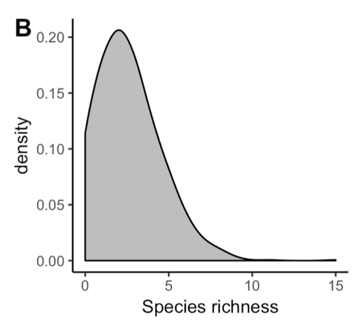
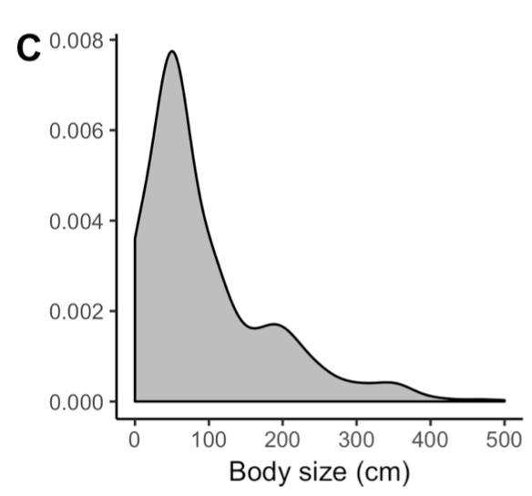

Title: Remote reefs and seamounts are the last refuges for marine predators across the Indo-Pacific

Link to the paper:
https://journals.plos.org/plosbiology/article?id=10.1371/journal.pbio.3000366#pbio.3000366.s007


Introduction: 
With technological advancements taking place in the fisheries industry, there has been unprecedented access to populations of marine predators including sharks, tuna, and billfishes, among others. In order to protect and preserve populations of marine predators, it is necessary to identify critical habitats of these marine predators across shallow coral reefs and in the deep ocean. 1041 mid-water baited videos were used to survey sharks and other pelagic predators. Three predator community attributes were modeled as a function of either geomorphology, environmental conditions, and human pressures: species richness, mean maximum body size, and shark abundance. All three attributed were primarily driven by geomorphology and environmental conditions, while human pressures, specifically distance to human markets, influenced body size and shark abundance, but not species richness. Refuges were identified > 1250 km from human markets and were identified as remote and shallow seabeds (e.g. seamounts, submerged banks, and reefs). Many of the refuges for both large-bodied predators and hotspots of shark abundance are currently under-represented within no-take marine protected areas (MPAs), and population recovery is unlikely to occur without strategic implementation of large, no-take MPAs that include these remote refuges as well as coastal areas. 

Data Used: 
The primary data used for statistical and visual analyses in this study was raw vertebrate species richness, body size, shark abundance, and a wide variety of environmental, geomorphological, and human pressure predator community attributes at 1041 individual baited video deployments spread between the Eastern Indian and Western Pacific Oceans. 

Analyses Conducted:
In this study, frequency distributions of species richness, body size, and shark abundance are plotted across all deployments. In addition, boosted regression trees are plotted to identify the relative contribution of variables contained within the three classes of predator community attributes to species richness, body size, and shark abundance across all 1041 deployments. In addition, species richness was assessed based on both distance to coast and 


Loading libraries
```{r}
library(readr)
library(gbm)
library(tidyverse)
library(ggplot2)
library(tm)
library(expm)
library(e1071)
library(pdp)
library(knitr)
library(dplyr)
library(janitor)
```


Importing data
```{r}
library(readxl)
f <- read_excel("data/raw.sr.bodysize.sharkabundance.xlsx")
colnames(f)[1] <- "location"
```

```{r}
knitr::opts_chunk$set(fig.path = "images/")
```

Plotting densities of species richness, body size, and shark abundance:

Species Richness
```{r}
#Species Richness
sr.density <- density(f$SR, from = 0)
sr.density.plot <- plot(sr.density)
```

```{r echo=FALSE, width="200px"}

```


Body Size
```{r}
#Body Size
body.size.density <- density(f$MaxL, from = 0)
body.size.density.plot <- plot(body.size.density)
```

```{r echo=FALSE, width="200px"}

```


Shark Abundance

I cannot explain how the difference in what I get and what the publication presents for sharks abundance (not the same data used for the publication figures)
```{r}
#Shark Abundance
#shark.abund.bysite <- f %>% group_by(f$location) 
#decomposing TaSharks by doing ((e^TaSharks) -1)
fb <- f %>% mutate(Shark.Abundance = exp(TaSharks)-1)
a <- ggplot(fb, aes(x = Shark.Abundance)) 
a + geom_density() 

summary(fb$Shark.Abundance)
summary(fb)
```
 
```{r echo=FALSE, width="200px"}
knitr::include_graphics("images/Figure1D.png")
``` 

Shark Abundance Box plots (Figure 1E)
```{r}
fb$location <- gsub("[0-9]", "", as.character(f$location)) #removing numbers from location column in df "f"
shark.abund.boxplot <- boxplot(fb$Shark.Abundance~fb$location)
shark.abund.boxplot
```


```{r echo=FALSE, width="200px"}
knitr::include_graphics("images/Figure1E.png")
```

Boosted Regression Trees for relative contribution of variables to Species Richness

Note: very odd how they give you the results in both figure and chart format but don't give background on how they went about narrowing down the number of community attributes used for the regression trees, or how they defined each variable as either a environmental, geomorphological, or human pressure predatory community attribute

Species Richness (all variables)
```{r}
#use species richness as the response variable, including all variables
boost.sp.rich.tree <- gbm(formula = fb$SR~+fb$Depth+fb$Chla_median+fb$Chla_sd+fb$SST_median+fb$SST_sd
                          +fb$pop_50km+fb$pop_500km+fb$Dist_nearest_pop+fb$Dist_nearest_market+fb$HDI+fb$Dcoast_km+fb$DCoralT_km+fb$DistSeamount_km+fb$GDP+fb$Dist_SMT1500+fb$FishingEffort01+fb$FishingEffort05, data = fb, n.trees = 100000)

boost.sp.rich.tree.100x <- gbm.more(boost.sp.rich.tree, 100, verbose = FALSE)
summary(boost.sp.rich.tree.100x)
```

```{r echo=FALSE, width="200px"}

```

Species Richness (using only environmental community attributes)
```{r}
boost.sp.rich.enviro.tree <- gbm(formula = SR~DCoralT_km+Chla_median+Chla_sd+SST_median+SST_sd, data = fb, n.trees = 100000)

boost.sp.rich.enviro.tree.100x <- gbm.more(boost.sp.rich.enviro.tree, 100, verbose = FALSE)
summary(boost.sp.rich.enviro.tree.100x)
```

Species Richness (using only geomorphological community attributes)
```{r}
boost.sp.rich.geomorph.tree <- gbm(formula = SR~Depth+Dcoast_km+DistSeamount_km+Dist_SMT1500, data = fb, n.trees = 100000)
boost.sp.rich.geomorph.tree.100x <- gbm.more(boost.sp.rich.geomorph.tree, 100, verbose = FALSE)
summary(boost.sp.rich.geomorph.tree.100x)
```

Species Richness (using only human pressure community attributes)

```{r}
boost.sp.rich.hum.press.tree <- gbm(formula = fb$SR~pop_50km+pop_500km+Dist_nearest_pop+Dist_nearest_market+HDI+GDP+FishingEffort01+FishingEffort05, data = fb, n.trees = 100000)

boost.sp.rich.hum.press.tree.100x <- gbm.more(boost.sp.rich.hum.press.tree, 100, verbose = FALSE)
summary(boost.sp.rich.hum.press.tree.100x)
```

Running BRT using results from [Species Richness(using only environmental community attributes) + Species Richness(using only geomorphological community attributes) + Species Richness(using only human pressure community attributes)]
Only including values with relative contribution of >=13%
```{r}
boost.sp.rich.combo.tree <- gbm(formula = fb$SR~SST_sd+DCoralT_km+SST_median+Dcoast_km+Depth+DistSeamount_km+Dist_SMT1500+Dist_nearest_pop+Dist_nearest_market+FishingEffort01, data = fb, n.trees = 100000)

boost.sp.rich.combo.tree.100x <- gbm.more(boost.sp.rich.combo.tree, 100, verbose = FALSE)
summary(boost.sp.rich.combo.tree.100x)
```


Partial Dependence Plot (Species richness ~ Distance to coast)
```{r}

y <- fb$SR
model.svm <- svm(SR~., data = fb, probability = TRUE)
pred <- predict(model.svm, fb, probability = TRUE)
table(y, pred)
par.Dcoast_km <- partial(model.svm, pred.var = c("Dcoast_km"), chull = TRUE)
plot.Dcoast_km <- autoplot(par.Dcoast_km, contour = TRUE)
plot.Dcoast_km
```

```{r echo=FALSE, width="200px"}

```

Partial Dependence Plot (Species richness ~ Distance to Coral Triangle)
```{r}
y <- fb$SR
model.svm2 <- svm(SR~., data = fb, probability = TRUE)
pred <- predict(model.svm2, fb, probability = TRUE)
table(y, pred)
par.DCoralT_km <- partial(model.svm2, pred.var = c("DCoralT_km"), chull = TRUE)
plot.DCoralT_km <- autoplot(par.DCoralT_km, contour = TRUE)
plot.DCoralT_km

```

```{r echo=FALSE, width="200px"}
knitr::include_graphics("images/Figure3C.png")
```


Boosted Regression Trees for relative contribution of variables to Body size


Body Size (all variables)
```{r}
#use species richness as the response variable, including all variables
boost.body.size.tree <- gbm(formula = fb$MaxL~+fb$Depth+fb$Chla_median+fb$Chla_sd+fb$SST_median+fb$SST_sd
                          +fb$pop_50km+fb$pop_500km+fb$Dist_nearest_pop+fb$Dist_nearest_market+fb$HDI+fb$Dcoast_km+fb$DCoralT_km+fb$DistSeamount_km+fb$GDP+fb$Dist_SMT1500+fb$FishingEffort01+fb$FishingEffort05, data = fb, n.trees = 100000)

boost.body.size.tree.100x <- gbm.more(boost.body.size.tree, 100, verbose = FALSE)
summary(boost.body.size.tree.100x)
```

```{r echo=FALSE, width="200px"}
knitr::include_graphics("images/Figure4A.png")
```

Body size (using only environmental community attributes)
```{r}
boost.body.size.enviro.tree <- gbm(formula = MaxL~DCoralT_km+Chla_median+Chla_sd+SST_median+SST_sd, data = fb, n.trees = 100000)

boost.body.size.enviro.tree.100x <- gbm.more(boost.body.size.enviro.tree, 100, verbose = FALSE)
summary(boost.body.size.enviro.tree.100x)
```


Body Size (using only geomorphological community attributes)
```{r}
boost.body.size.geomorph.tree <- gbm(formula = MaxL~Depth+Dcoast_km+DistSeamount_km+Dist_SMT1500, data = fb, n.trees = 100000)
boost.body.size.geomorph.tree.100x <- gbm.more(boost.body.size.geomorph.tree, 100, verbose = FALSE)
summary(boost.body.size.geomorph.tree.100x)
```


Body Size (using only human pressure community attributes)
```{r}
boost.body.size.hum.press.tree <- gbm(formula = MaxL~pop_50km+pop_500km+Dist_nearest_pop+Dist_nearest_market+HDI+GDP+FishingEffort01+FishingEffort05, data = fb, n.trees = 100000)

boost.body.size.hum.press.tree.100x <- gbm.more(boost.body.size.hum.press.tree, 100, verbose = FALSE)
summary(boost.body.size.hum.press.tree.100x)
```


Partial Dependence Plot (Body size ~ Depth)
```{r}
y <- fb$MaxL
model.svm <- svm(MaxL~., data = fb, probability = TRUE)
pred <- predict(model.svm, fb, probability = TRUE)
table(y, pred)
par.Depth <- partial(model.svm, pred.var = c("Depth"), chull = TRUE)
plot.Depth <- autoplot(par.Depth, contour = TRUE)
plot.Depth
```


```{r echo=FALSE, width="200px"}

```

Partial Dependence Plot (Body size ~ Distance to nearest market)
```{r}
y <- fb$MaxL
model.svm <- svm(MaxL~., data = fb, probability = TRUE)
pred <- predict(model.svm, fb, probability = TRUE)
table(y, pred)
par.Dist_nearest_market <- partial(model.svm, pred.var = c("Dist_nearest_market"), chull = TRUE)
plot.Dist_nearest_market <- autoplot(par.Dist_nearest_market, contour = TRUE)
plot.Dist_nearest_market
```

```{r echo=FALSE, width="200px"}
knitr::include_graphics("images/Figure4C.png")
```

Counting number of datapoints in each location
```{r}
table(fb['location'])
```


Plotting densities of species richness and body size (shark abundance not included)

Species Richness
```{r}


fb <- fb %>% 
  mutate(unprotected )


unprotected.locations <- c("GAM", "NEW", "PAL", "RAP", "RAPB", "TON")
part.protected.location <- c("TIM", "DHI", "PC")
no.take.mpas <- c("CH")

protection.level <- c("unprotected.locations", "part.protected.location", "no.take.mpas")


a <- ggplot(fb, aes(x = SR)) + geom_density_ridges(aes(fill = protection.level)) + scale_fill_manual(values = c("#00AFBB", "E7B800", "FC4E07"))
a


sr.density <- density(f$SR, from = 0) 
sr.density.plot <- plot(sr.density) %>%
  group_by(protection.level)
```

```{r echo=FALSE, width="200px"}
knitr::include_graphics("images/Figure6A.B.png")
```

```{r}

```

```{r}

```

```{r}

```

```{r}

```

```{r}

```

```{r}

```

```{r}

```

```{r}

```

```{r}

```